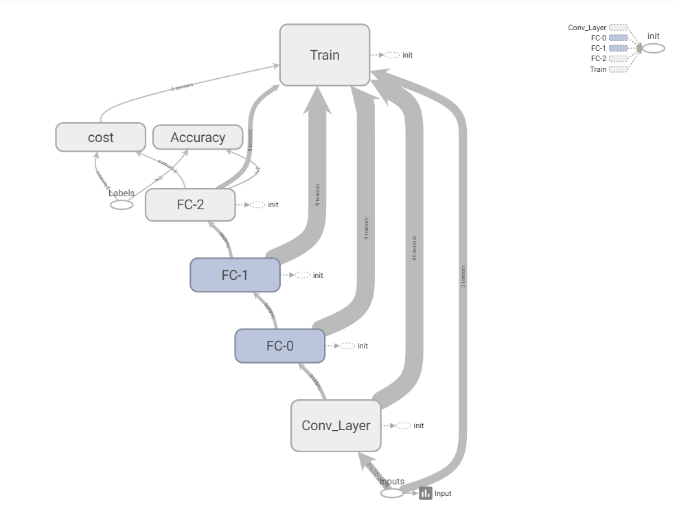

# Image Recognition 

The objective of this project is to learn to know how image recognition works using covolutiona neural network. It has been programmed in such a way that you can 
choose the architecture of CNN. To make it easier to understand, debug, I have included a suite of visualization tools called **TensorBoard**. The program
 has been wrtitten in Python.

